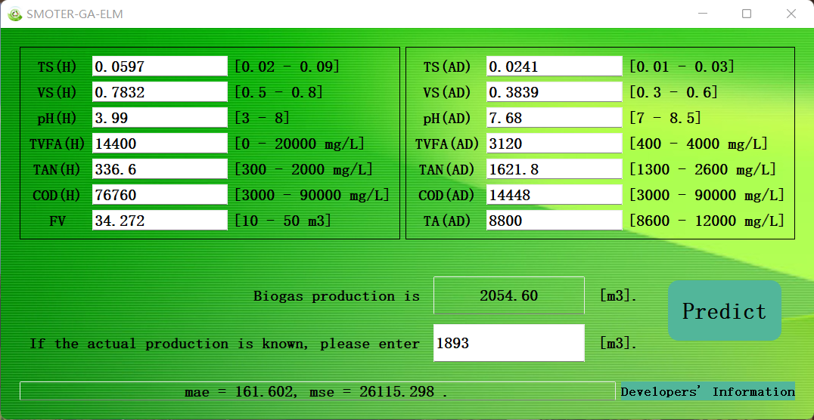

# ELM_exe

## Background

ELM.exe is the experimental product of paper Accurate prediction and optimization of plant-scale biogas production using novel ELM integrated GA and SMOTER.

The Experiment uses SOMTER to balance the precious realistic factory data and optimizes ELM by GA to obtain a set of weights and biases that have good prediction accuracy for both parallel tanks biogas production of this factory.

The ELM is encapsulated with weights and biases to facilitate the use of similar scenarios.

## Program Principle

ELM.exe encapsulates a 14-dimensional input, 1-dimensional output ELM network with a 40-neuron hidden layer and the network's weights, bias, and $\beta$ parameters.

By entering the corresponding feature values, the prediction of biogas production can be obtained.

## Program Testing

## Ending Words

If you have any questions or any bugs are found, please feel free to contact me.

Your comments and suggestions are welcome!

